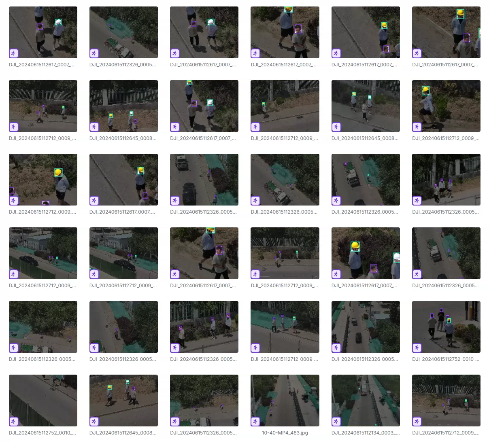
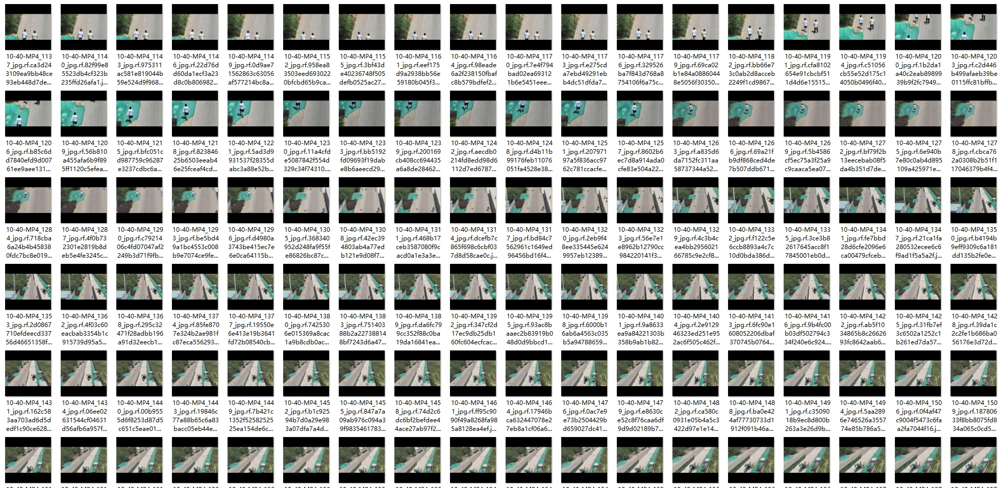
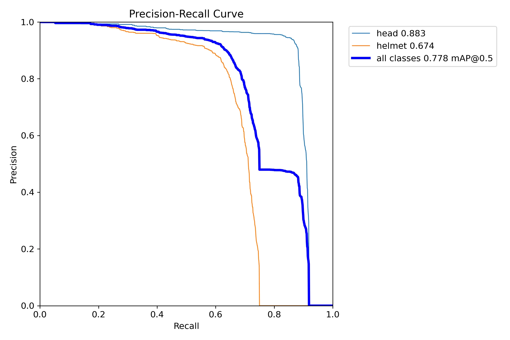
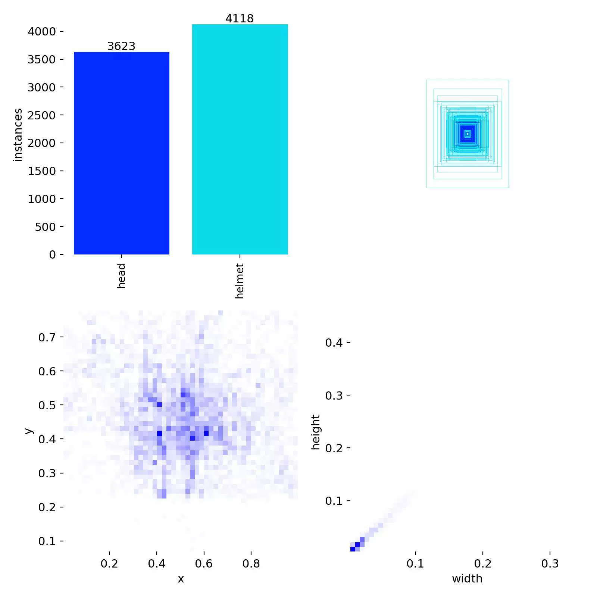
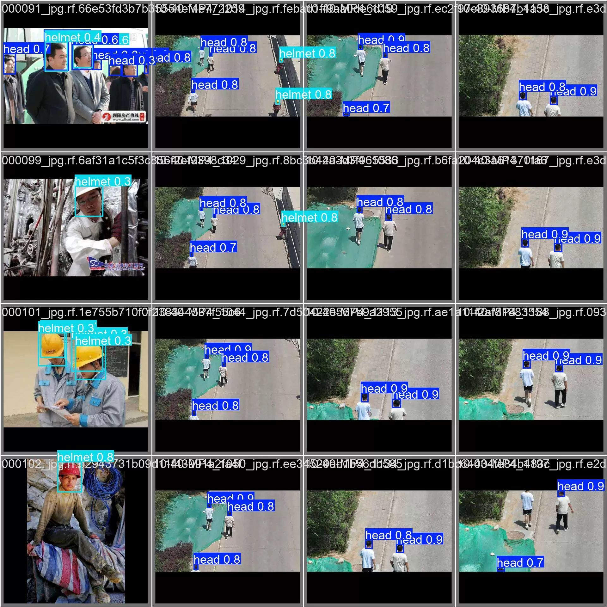
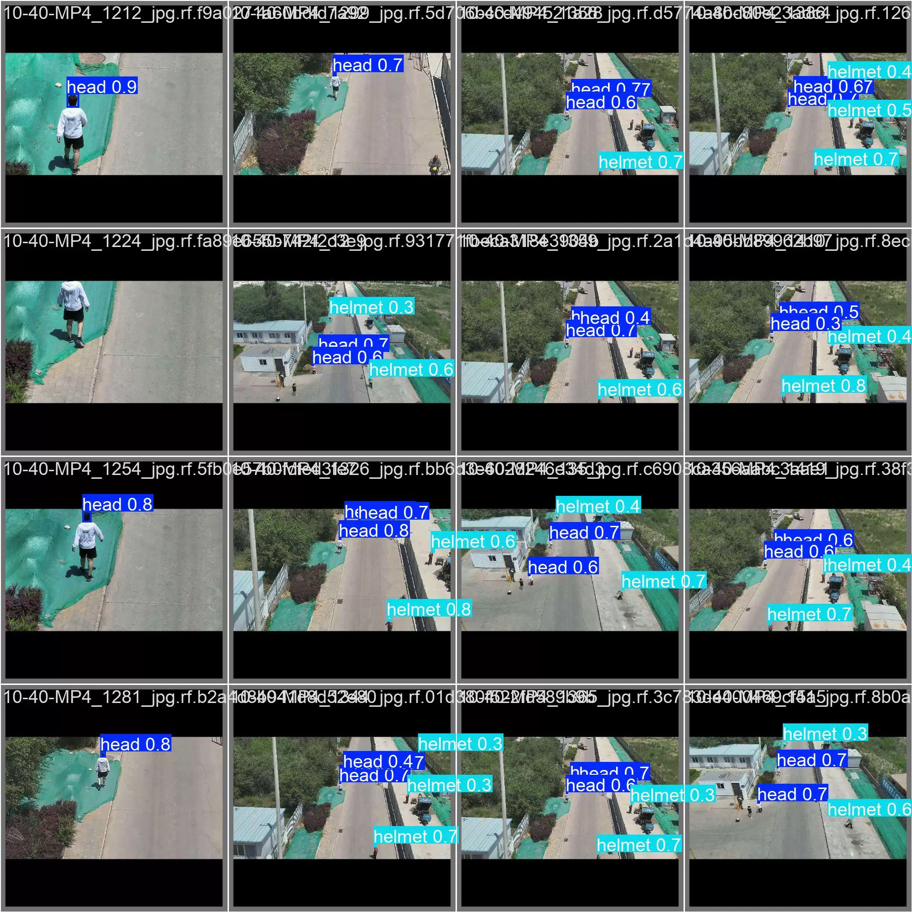
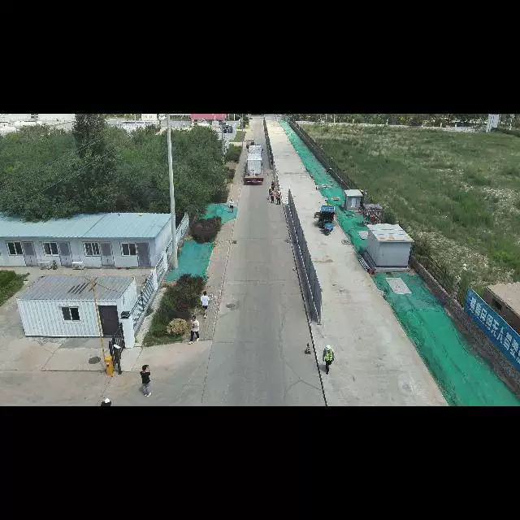
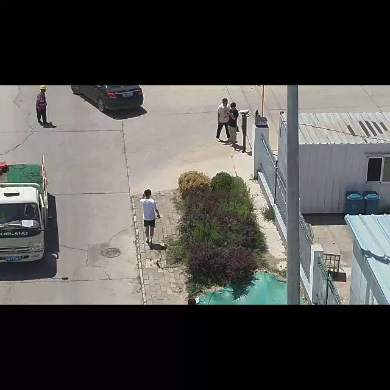
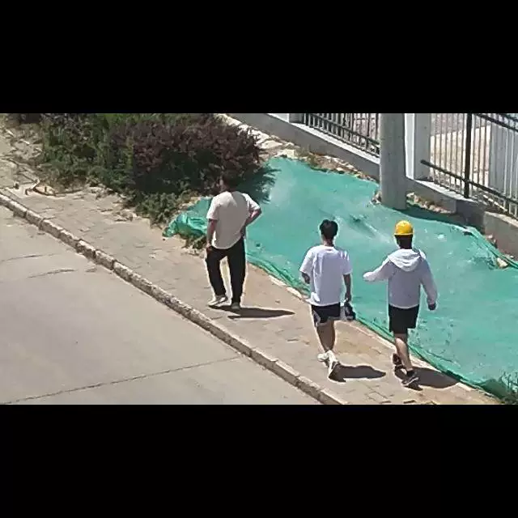

## Body

Drone Safety Helmet Identification Dataset - YOLO format

Totally 3227 images, labeled and divided into training set, test set, validation set.
It is divided into two classes: 'head' and 'helmet'.

YOLOv8 weight file (Training rounds 100, pre-trained model YOLOv8m.pt, mAP 0.778) with training results file
YOLOv11 weight file (Training rounds 100, pre-trained model YOLO11m.pt, mAP 0.812) with training results file

## Images

item_1034682075826

Here is a pay link on Stripe ( https://buy.stripe.com/3cs8yP7sY87d0vu9AB ). Please contact me lonlonago@foxmail.com after funding $89, and I will send you a complete data files , thank you!

